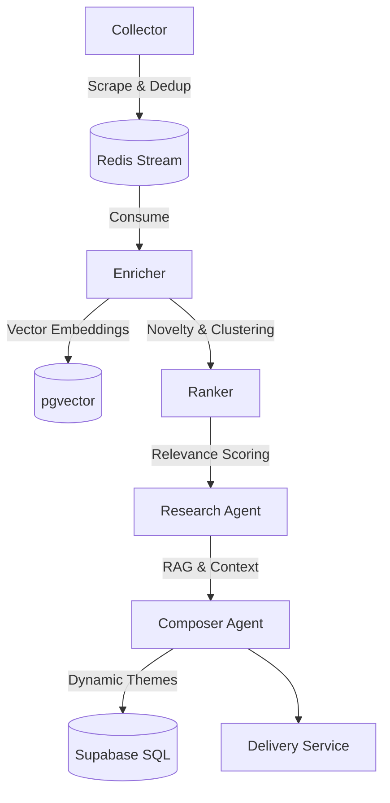

# TechPulse: Developer Documentation 🛠️

This document provides a technical deep-dive into the TechPulse architecture, data pipeline, and security model.

## 🏗️ Architecture & Data Flow

TechPulse V2 transitions from a simple RSS aggregator to an **Agentic Tech Intelligence System**. It uses a pipeline structure defined by five major stages.



### 1. The Collection Pipeline (`Collector`)
The collector runs concurrently across all active RSS sources listed in the `rss_sources` table.
- **Freshness**: Uses a strict publication date cutoff.
- **Deduplication**: Uses Redis for fast URL and title-slug hashing (`seen:{user_id}:{hash}`).
- **Source Health**: Captures metrics on ingestion vs delivery to auto-downgrade noisy feeds.

### 2. The Enrichment Engine (`Enricher`)
- **Embeddings**: Uses `sentence-transformers/all-mpnet-base-v2` (768-dim) for high-accuracy semantic representation.
- **Local Embedding Engine**: Embeddings are computed locally on the server via `embedder.py`, which lazily instantiates the model as a thread-safe singleton.
- **Semantic Deduplication**: Checks `pgvector` index via HNSW for near-identical matches (threshold: 0.92) to suppress redundant news.
- **Novelty Scoring**: Calculates uniqueness against the user's historical feed using a recency-weighted similarity decay.

### 3. The Decide & Research Pipeline (`Ranker` & `Research Agent`)
- **Scoring**: A weighted additive formula (Signals: Base LLM, Novelty, Source Quality, Topic Match, Priority Boost).
- **Feedback Loop**: A dedicated processing service aggregates user signals (`clicked`, `dismissed`, `saved`) to update source quality scores in real-time.
- **Research Agent**: A LangGraph node that retrieves historical user context from pgvector to synthesize a summary and extract the "Why It Matters" takeaway.

### 4. Distribution & Curation (`Composer` & `Delivery`)
- **Dynamic Theming**: The Composer Agent assigns dynamic thematic groupings (e.g. "Generative AI", "Developer Tools") replacing hardcoded taxonomies.
- **Delivery**: High-scoring items are packaged into a narrative morning digest grouped by the AI-assigned themes and sent via webhooks to Slack/Discord.

---

## 🔒 Multi-Tenant Security Model

TechPulse Pro uses **Supabase Row Level Security (RLS)** to ensure data isolation.

| Table | Policy | Scope |
| :--- | :--- | :--- |
| `articles` | `auth.uid() = user_id` | Users can only see/delete their own news. |
| `app_config` | `auth.uid() = user_id` | Topic settings are private per user. |
| `rss_sources` | `auth.uid() = user_id` | Sources are isolated per tenant. |
| `tenant_profiles` | `auth.uid() = user_id` | Tenant profiles and webhook configurations are isolated. |

### CLI Tool Contexts:
- **`pulse` (Unified)**: Handles both user-facing queries (using the user's Supabase JWT) and system operator tasks (like pipeline runs and tenant management using the service-role client).

---

## 🌐 REST API Router

FastAPI server exposing pipeline triggers, user statistics, configuration updates, and interactive cited semantic search. All endpoints require `X-User-Id` request header validations for tenant isolation.

### Endpoints:
*   `GET /health`: System health status (public).
*   `GET /config/` / `PUT /config/`: Fetch and update user topic filters.
*   `GET /config/stats`: Fetch high-level tenant stats (total articles, active sources, last delivery).
*   `GET /sources/` / `POST /sources/`: List and register new RSS feed sources.
*   `PATCH /sources/{id}/toggle`: Toggle active/inactive status of an RSS source.
*   `GET /articles/`: Fetch AI-curated digests scored above delivery threshold.
*   `POST /articles/{id}/feedback`: Log click/dismiss/save signals.
*   `POST /pipeline/run`: Manually trigger background ingestion and delivery pipeline.
*   `POST /search/rag`: Query personal catalog via LangGraph-orchestrated cited RAG.

---

## 🛠️ Development Guidelines

### Coding Standards
- **Logging**: Use `loguru` for all observability. Avoid `print()`.
- **Typing**: Use strict Python type hints (`typing` module) for all function signatures.
- **Models**: Use `Pydantic` for data validation and LLM structured outputs.

### Testing
We use `pytest` for logic verification.
```bash
# Run unit tests
PYTHONPATH=src uv run pytest tests/unit

# Run RAG specific unit tests
PYTHONPATH=src uv run pytest tests/unit/test_rag.py
```

### Resetting the System
During testing, you can wipe the pipeline state:
```bash
uv run pulse reset --confirm
```
