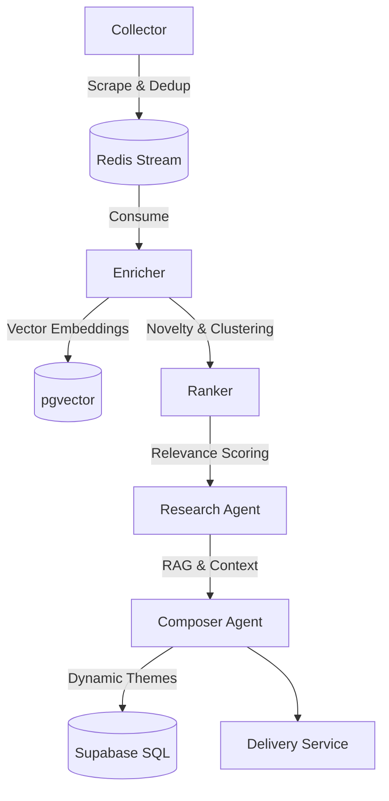

# TechPulse: Developer Documentation 🛠️

This document provides a technical deep-dive into the TechPulse architecture, data pipeline, and security model.

## 🏗️ Architecture & Data Flow

TechPulse V2 transitions from a simple RSS aggregator to an **Agentic Tech Intelligence System**. It uses a pipeline structure defined by five major stages.


```mermaid
graph TD
    Collector[Collector] -->|Scrape & Dedup| Stream[(Redis Stream)]
                             
    Stream -->|Consume| Enricher[Enricher]
    Enricher -->|Vector Embeddings| VectorDB[(pgvector)]
    Enricher -->|Novelty & Clustering| Ranker[Ranker]
    
    Ranker -->|Relevance Scoring| ResearchAgent[Research Agent]
    ResearchAgent -->|RAG & Context| ComposerAgent[Composer Agent]
    
    ComposerAgent -->|Dynamic Themes| DB[(Supabase SQL)]
    ComposerAgent --> Delivery[Delivery Service]
```

### 1. The Collection Pipeline (`Collector`)
The collector runs concurrently across all active RSS sources listed in the `rss_sources` table.
- **Freshness**: Uses a strict publication date cutoff.
- **Deduplication**: Uses Redis for fast URL and title-slug hashing (`seen:{user_id}:{hash}`).
- **Source Health**: Captures metrics on ingestion vs delivery to auto-downgrade noisy feeds.
- **Domain Throttling**: Automatically spaces out fetches to the same domain using a 2-second rate-limiting delay (`asyncio.Lock`) to prevent target server IP bans.

### 2. The Enrichment Engine (`Enricher`)
- **Embeddings**: Uses `sentence-transformers/all-mpnet-base-v2` (768-dim) for high-accuracy semantic representation.
- **Local Embedding Engine**: Embeddings are computed locally on the server via `embedder.py`, which lazily instantiates the model as a thread-safe singleton.
- **Semantic Deduplication**: Checks `pgvector` index via HNSW for near-identical matches (threshold: 0.92) to suppress redundant news.
- **Novelty Scoring**: Calculates uniqueness against the user's historical feed using a recency-weighted similarity decay.

### 3. The Decide & Research Pipeline (`Ranker` & `Research Agent`)
- **Scoring & Personalization**: A weighted additive formula incorporating base LLM relevance, novelty, source health, keyword matching, and **15% semantic personalization** (cosine similarity against liked/disliked vector centroids).
- **Feedback Loop**: A dedicated processing service aggregates user clicks and action signals (`clicked`, `dismissed`, `saved`, `more_like_this`, `less_like_this`) to dynamically update both source quality scores and user interests.
- **Research Agent**: A LangGraph graph executing:
  1. Historical RAG context retrieval (`pgvector`).
  2. Web search context collection (`Tavily API`).
  3. Context-enhanced summarization (`qwen/qwen3-32b`).
  4. Factual verification check to audit and log hallucinations (`llama-3.1-8b-instant`).

### 4. Distribution & Curation (`Composer` & `Delivery`)
- **Dynamic Theming**: The Composer Agent assigns dynamic thematic groupings (e.g. "Generative AI", "Developer Tools") replacing hardcoded taxonomies.
- **Delivery**: High-scoring items are packaged into a narrative morning digest grouped by the AI-assigned themes and sent via webhooks to Slack/Discord.

---

## 🔒 Multi-Tenant Security Model

TechPulse Pro uses **Supabase Row Level Security (RLS)** to ensure data isolation.

| Table | Policy | Scope |
| :--- | :--- | :--- |
| `articles` | `auth.uid() = user_id` | Users can only see/delete their own news. |
| `app_config` | `auth.uid() = user_id` | Topic settings are private per user. |
| `rss_sources` | `auth.uid() = user_id` | Sources are isolated per tenant. |
| `tenant_profiles` | `auth.uid() = user_id` | Tenant profiles are isolated. Webhooks are symmetrically encrypted via `pgcrypto`. |

### CLI Tool Contexts:
- **`pulse` (Unified)**: Handles both user-facing queries (using the user's Supabase JWT) and system operator tasks (like pipeline runs and tenant management using the service-role client).

---

## 🌐 REST API Router

FastAPI server exposing pipeline triggers, user statistics, configuration updates, and interactive cited semantic search. All endpoints require `X-User-Id` request header validations for tenant isolation.
A Redis-backed rate-limiting middleware limits public requests on the `/click` and `/action` endpoints to a maximum of **30 requests per minute per IP**.

### Endpoints:
*   `GET /health`: System health status (public).
*   `GET /config/` / `PUT /config/`: Fetch and update user topic filters.
*   `GET /config/stats`: Fetch high-level tenant stats (total articles, active sources, last delivery).
*   `GET /sources/` / `POST /sources/`: List and register new RSS feed sources.
*   `PATCH /sources/{id}/toggle`: Toggle active/inactive status of an RSS source.
*   `GET /articles/`: Fetch AI-curated digests scored above delivery threshold.
*   `POST /articles/{id}/feedback`: Log click/dismiss/save signals.
*   `GET /articles/{id}/click`: Click-redirect endpoint to track user clicks.
*   `GET /articles/{id}/action`: Log thumbs up/down feedback directly via chat action buttons.
*   `POST /pipeline/run`: Manually trigger background ingestion and delivery pipeline.
*   `POST /search/rag`: Query personal catalog via LangGraph-orchestrated cited RAG.

---

## ⚙️ Operations & Production Deployment

In production, the API server and scheduled task timers run under the systemd user manager (`systemctl --user`). The API runs locally on port `8089` and is exposed securely using a **Cloudflare Tunnel** (`cloudflared`):
1. Routes requests to `https://pulse-api.nullnex.com`.
2. Hides the VM's public IP address entirely.
3. Automatically provides and renews edge SSL/HTTPS certificates.

### Automated CI/CD
The project is deployed automatically to the production VM via GitHub Actions when changes are merged into `main`. The workflow is located at [.github/workflows/ci-cd.yml](file://../.github/workflows/ci-cd.yml).

### Unified Deployment Script
All deployment steps are encapsulated in [scripts/deploy.sh](file://../scripts/deploy.sh):
- **Dependencies**: Runs `uv sync --frozen` to prepare the isolated virtual environment.
- **Database Migrations**: Runs `uv run python scripts/migrate.py` to keep database schema up to date.
- **Systemd User Configuration**: Templates the service and timer files dynamically (replacing absolute directories and omitting explicit User/Group boundaries for systemd --user manager mode) and copies them to `~/.config/systemd/user/`.
- **Linger Activation**: Keeps user services alive after the SSH session disconnects.
- **Service Management**: Restarts `techpulse-collector.timer`, `techpulse-pulse.timer`, `techpulse-archive.timer`, `techpulse-keepalive.timer`, `techpulse-purge.timer`, and `techpulse-api.service`.
- **Health Check**: Runs a health loop against `http://localhost:8089/health` to verify success.

To trigger a manual deploy on the VM, execute:
```bash
chmod +x scripts/deploy.sh
./scripts/deploy.sh
```

---

## 🛠️ Development Guidelines

### Coding Standards
- **Logging**: Use `loguru` for all observability. Avoid `print()`.
- **Typing**: Use strict Python type hints (`typing` module) for all function signatures.
- **Models**: Use `Pydantic` for data validation and LLM structured outputs.

### Testing
We use `pytest` for logic verification.
```bash
# Run unit tests
PYTHONPATH=src uv run pytest tests/unit

# Run RAG specific unit tests
PYTHONPATH=src uv run pytest tests/unit/test_rag.py
```

### Resetting the System
During testing, you can wipe the pipeline state:
```bash
uv run pulse reset --confirm
```
